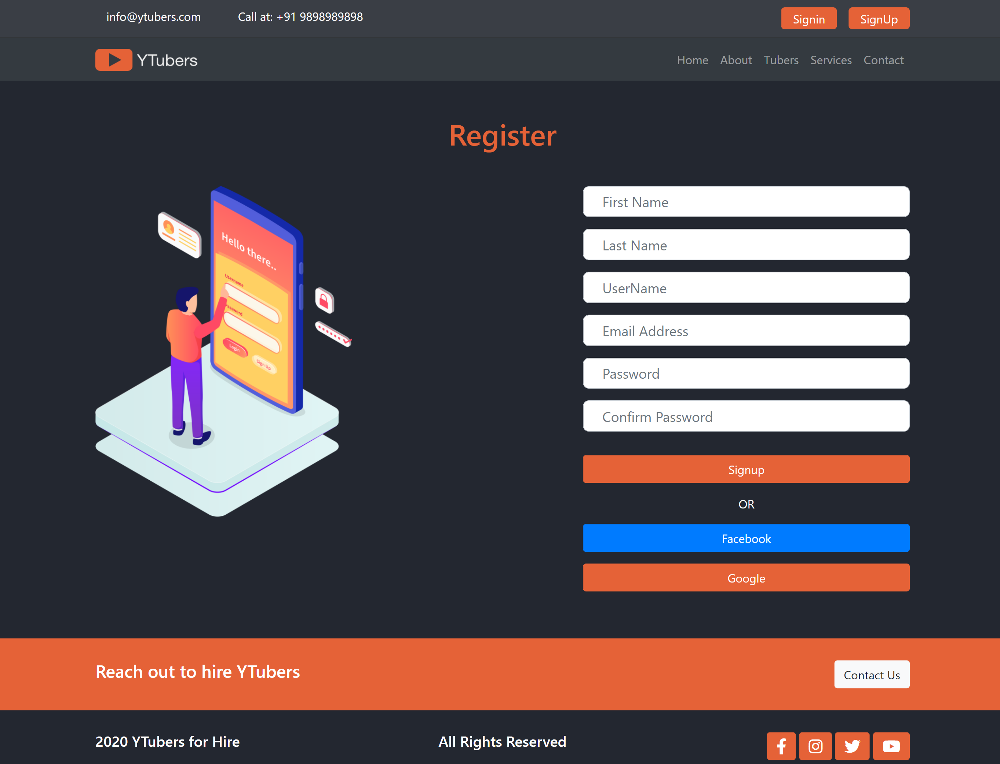

# ytubers
It is a Full Stack Django based Project where in most of the data is configured in backend using django.
This project is about hiring youtubers for your Promotion
Here we provide you with the details of youtubers like their locality price and other details.
You can opt for any youtuber based on your requirements and then check out their rates.
If you feel like going further with them you can fill in the form on their individual page.

### HomePage🕍🏡 ###
<Pre>
1. Header section
   1. Contact Info.
   2. Login & signup button if not logged in.
   3. Dashboard & login Button for logged in users.
2. Navigation Bar
   1. Banner Navigating to Homepage.
   2. Links to Other pages.
3. Search Bar
   1. Keyword Search based on Query sent to the database.
4. Featured Youtubers Section
   1. Youtubers data is fetched from back end if the featured toggle is on.
   2. Anchor links on the image which redirect you to individual youtuber page
5. Latest Onboard section
    1. Consists of all the youtubers in the database ordered based on date they were added
    2. Anchor links on images to redirect to their individual pages
6. The Teams Section
   1. Includes all the data uploaded to the teams table from backend and is reflected in the front End.
   2. The carousel keeps changind automatically.
7. Footer
    1. Basic ContactUs Page button to redirect
    2. Social Links

</Pre>

</img>

### About Page❓❔ ###
About Page includes a Paragraph Controlled completely from backend and the other paragraph controlled from front end.
More paragraph can be added from backend and they will be reflected automatically in the front end of the website.
All the aspects such as Headline description and photo can be added from the back end or the admin panel.

The teams section of the about page is same as the one on the homepage and uses the same database.

</img>

### Youtubers (tubers) Page 💫💫💫 ###

</img>

 
This is the page which basically contains all the youtubers and the search option for them to search.
The search can be done based on:
<pre>
   1. City
   2. Camera Type
   3. Category
</pre>
The Youtuber card contains Basic data About the youtuber which is controlled from the backend.
the Data Displayed on card contains
<pre>
   1. City
   2. Age
   3. Height
   4. Crew Type
   5. Camera Brand
   6. Subscriber Count
</pre>

### Contact Page 📞📲  ###
This page Basically Contains a Contact Form the content from which on submit is saved at the backend with all the deatils.
Once the data is at backend the site admin can go trough the requests and can read them and act accordingly.

All the fields in contact form Except for the Company name are mandatory as they will help admin to get back to you.

If the user is logged in the Email is auto populated with the user's email. Else the user must enter it.

</img>

### Youtuber's Detail Page ###
Here you can get detailed information about the selected youtuber 
You will also be provided with an intro video of the youtuber based on which you can decide to choose him/her.
The Description includes all the details related to promotions and other Stuff. Right now its just dummy text.
I Used CK-Editor rich text so the description can be formatted from the backend itself based on the needs.

</img>

### Dashboard 📣🛴🛹 ###
The First thing for visiting here is you must be logged in.
As soon as the login is successful user is redirected to the dashboard.
The dashboard is still a dummy page with no dynamic data except for the name of the user after hi which changes from user to user.

If any other person without logging in tries to visit the dashboard by changing the URL the page will return a 404 Error.

</img>

### login page 🔐🔑 ###
Authentication based on users who are registered in database.
The Users can register at the SignUp Page and then come to this pahe to login.
The Google and Facebook logins use the APIs from respective providers.

Invalid credentials message for non regidtered users as well as blank login.

</img>

### SignUp page 🔏🛠 ###
This page is responsible for taking user data and registering them in to the database.
On successful Registration user will be redirected to Login page and he/she will be able to login with the credentials used to register.

Requirements to register
<pre>
1. Username Must be unique
2. Unique Email i.e. email which is not registered in this website.
3. password Length should be greater than 7
4. Username length must be greater than 7
5. Username Must not contain space
</pre>

</img>

